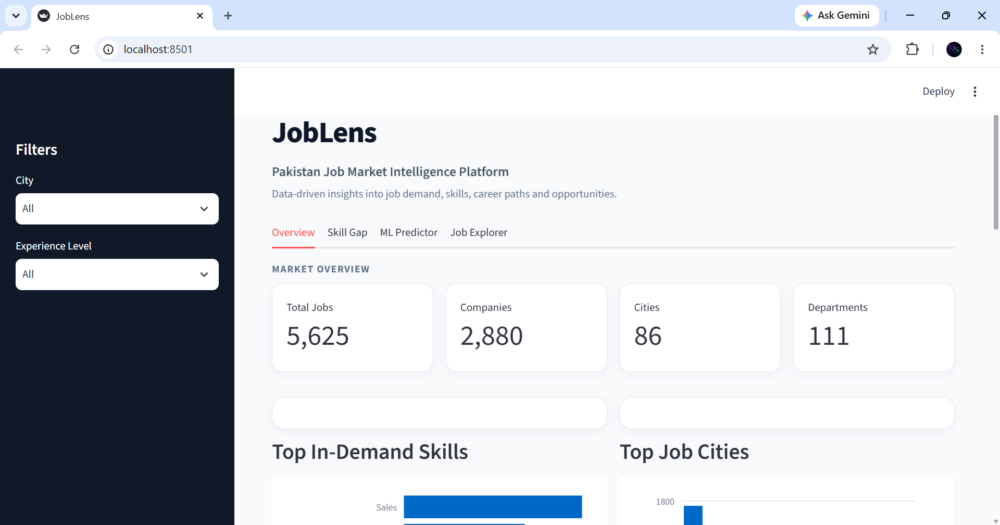
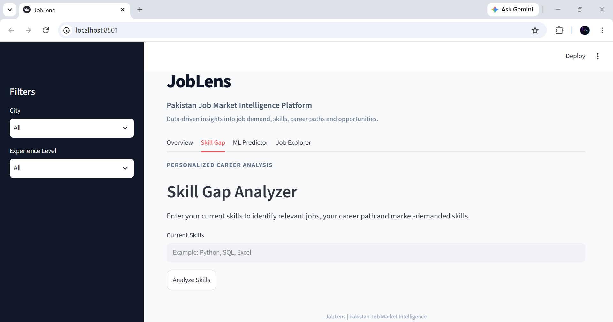
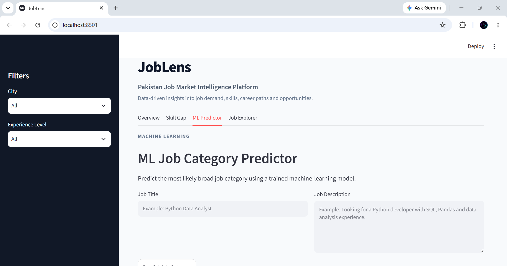
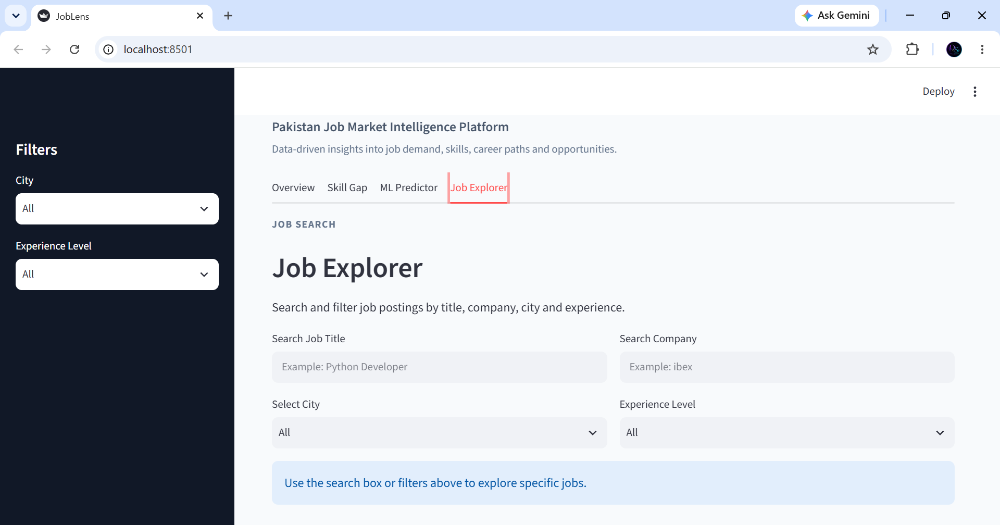

# JobLens

JobLens is a Python-based Pakistan Job Market Intelligence Platform that analyzes Pakistani job postings and turns them into actionable insights about job demand, skills, career paths, and opportunities through an interactive Streamlit dashboard.

## Problem Statement

Students and job seekers often find it difficult to understand which skills are in demand, which roles match their current skills, and what additional skills could improve their career opportunities.

JobLens addresses this problem by processing Pakistani job-market data and providing:

* Job-market analytics
* Skill extraction
* Career-path detection
* Skill-gap analysis
* Job matching
* Machine-learning based job department prediction
* Searchable job exploration

## Objectives

1. Analyze Pakistani job-market data.
2. Clean and prepare raw job-posting data for analysis.
3. Extract relevant skills from job titles and descriptions.
4. Identify high-demand skills and job-market trends.
5. Analyze job opportunities by city, department, and experience level.
6. Compare user skills with relevant job requirements.
7. Recommend additional skills based on relevant job demand.
8. Calculate job-match scores for users.
9. Provide an ML-based job department classification feature.
10. Present results through an interactive Streamlit dashboard.


## Project Screenshots

### Dashboard


### Skill Gap Analyzer


### ML Job Category Predictor


### Job Explorer


## Project Demo
(https://youtu.be/i0PbfDPpd0M)

## Dataset

The project uses a Pakistani job-market dataset containing:

* Job Name
* Company Name
* Job Type
* Experience Required
* Department
* Job Description (JD)
* City
* Date Posted

The original dataset contained 6,680 job postings and 9 columns.

During preprocessing:

* 1,055 duplicate rows were removed.
* Missing company names were replaced with `Unknown Company`.
* The unused `label` column was removed.
* Dates were converted to datetime values.
* Experience requirements were converted into numerical and categorical features.
* Text fields were normalized.
* The resulting dataset contains 5,625 unique job postings.

## Key Dataset Statistics

| Metric              | Value |
| ------------------- | ----: |
| Unique Job Postings | 5,625 |
| Companies           | 2,880 |
| Cities              |    86 |
| Departments         |   111 |

These figures are historical dataset statistics, not current live vacancy counts.

## Main Features

### Market Overview

The dashboard provides:

* Total job postings
* Number of companies
* Number of cities
* Number of departments
* Top in-demand skills
* Top job cities
* Experience distribution
* Job-posting trends over time

### Skill Extraction

JobLens processes job titles and descriptions to identify relevant skills using Python text processing and pattern-based matching.

Examples include:

* Python
* SQL
* Java
* PHP
* JavaScript
* React
* Angular
* .NET
* Excel
* Power BI
* WordPress
* Marketing
* SEO

The extracted skills are reused by the skill-gap and job-matching modules.

### Skill Gap Analyzer

Users can enter their current skills, for example:

```text
Python, SQL, Excel
```

JobLens then:

* Identifies matched skills.
* Finds relevant job postings.
* Detects a career group.
* Identifies additional skills frequently required by relevant jobs.

Career groups include:

* Data & Analytics
* Web Development
* Software Development
* Marketing

### Job Matching

The job-matching module compares user skills with extracted job skills and provides:

* Job title
* Company
* City
* Experience requirement
* Match score
* Matched skills
* Missing skills

The matching system is based on skill overlap and coverage scoring. It is not presented as a trained recommendation model.

### AI Job Category Predictor

JobLens includes an experimental machine-learning classification module.

Pipeline:

```text
Job Title + Job Description
        ↓
TF-IDF Vectorization
        ↓
Logistic Regression
        ↓
Predicted Department
```

The current model was trained and evaluated using:

* Training samples: 4,500
* Testing samples: 1,125
* Test accuracy: 49.07%

The dashboard also displays the top three predicted departments and their probability scores.

Because the source department labels are noisy and overlapping, this classifier is treated as an experimental ML component rather than a high-accuracy production classifier.

Saved model artifacts:

```text
models/
├── job_department_model.pkl
└── tfidf_vectorizer.pkl
```

### Job Explorer

Users can search and filter job postings by:

* Job title
* Company
* City
* Experience level

Each result can display:

* Company
* City
* Department
* Experience
* Posting date
* Extracted skills
* Job description

## Technology Stack

### Programming

* Python

### Data Processing

* Pandas
* Python regular expressions
* Python AST parsing

### Machine Learning

* Scikit-learn
* TF-IDF
* Logistic Regression
* Joblib

### Visualization

* Plotly

### Frontend

* Streamlit
* Custom CSS

## Project Architecture

```text
                    Pakistan Job Dataset
                             |
                             v
                    Data Cleaning
                             |
                             v
                    Experience / Date
                      Transformation
                             |
                             v
              Job Title + Job Description
                             |
              +--------------+--------------+
              |                             |
              v                             v
       Skill Extraction               ML Classification
              |                             |
              v                             v
       Market Analytics               Department Prediction
              |
        +-----+------+
        |            |
        v            v
   Skill Gap     Job Matching
        |            |
        +-----+------+
              |
              v
       Streamlit Dashboard
```

## Project Structure

```text
JobLens/
│
├── data/
│   ├── Pakistan_Jobs.csv
│   ├── cleaned_jobs.csv
│   ├── jobs_with_skills.csv
│   └── analysis_output/
│       ├── experience_distribution.csv
│       ├── job_types.csv
│       ├── monthly_jobs.csv
│       ├── skill_demand.csv
│       ├── top_cities.csv
│       ├── top_companies.csv
│       └── top_departments.csv
│
├── models/
│   ├── job_catgory_model.pkl
│   └── job_catgory_vectorizer.pkl
│
├── app.py
├── data_cleaning.py
├── skill_extraction.py
├── analysis.py
├── visualizations.py
├── matching.py
├── ml_model.py
├── requirements.txt
└── README.md
```

## Installation

### 1. Open the project directory

Open the JobLens folder in VS Code or another Python-compatible IDE.

### 2. Install dependencies

```bash
pip install -r requirements.txt
```

### 3. Run the application

```bash
streamlit run app.py
```

The application will normally be available at:

```text
http://localhost:8501
```

## Typical User Flow

```text
Open JobLens
      ↓
Apply city / experience filters
      ↓
Review market analytics
      ↓
Enter current skills
      ↓
View career path and skill gap
      ↓
Review best matching jobs
      ↓
Use AI Job Category Predictor
      ↓
Search and explore specific jobs
```

## Example

### Input Skills

```text
Python, SQL, Excel
```

### Example Output

```text
Detected Career Path:
Data & Analytics
```

The system then identifies relevant job postings and ranks additional skills based on their occurrence in those relevant postings.

## Limitations

* The dataset represents historical job postings and is not a live 2026 vacancy feed.
* Skill extraction depends on the configured skill dictionary and text-matching rules.
* Job matching is based on extracted skill overlap and scoring rules.
* The ML department classifier has limited predictive performance because the source department labels are noisy and overlapping.
* Salary analysis is not included because the selected dataset does not contain salary information.
* No user authentication or persistent user accounts are included.

## Future Improvements

* Live job data through APIs or web scraping.
* More advanced NLP-based skill extraction.
* Semantic job matching using embeddings.
* Salary and compensation analysis.
* Resume upload and automatic skill extraction.
* Job recommendations using a trained ranking model.
* User accounts and saved jobs.
* Cloud deployment.
* Model monitoring and retraining with newer job-market data.

## Conclusion

JobLens combines data cleaning, text processing, market analytics, skill-gap analysis, rule-based job matching, and an experimental machine-learning classifier into a single interactive Python application.

The project demonstrates how Python can transform raw job-market data into useful career and recruitment insights through an end-to-end data product.
::: 
